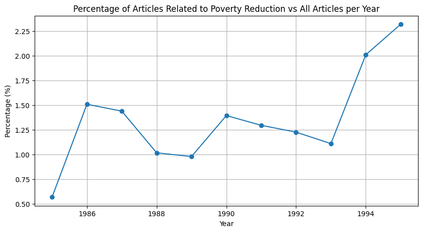

# Media Framing of Poverty Alleviation in China: A Textual Analysis of "People's Daily"

## Project Description

This research project explores the framing of poverty alleviation in the "People's Daily," the official newspaper of the Communist Party of China. Utilizing a corpus of approximately 15,000 articles from 1980 to 2023 (inferred by a sample of 5,000 articles from yeaar 1985-1995) related to poverty reduction, this study identifies and analyzes the underlying development ideas and the frames of poverty alleviation. The project employs content analysis methods including topic modeling, clustering, and NLP methods to track the continuity and change in poverty alleviation discourse, providing insights into how media frames might identify discrepancies between official government announcements and the narratives being promoted to the public.

## Research Questions

1. To identify the change of frames used to discuss poverty alleviation, and how they are employed by People’s Daily in its reporting.
2. To identify the narrative gap between People’s Daily’s reports and Communist Party of China’s documents circulated within the party.

## File Explanation

1. /Data: The full data of People's Daily articles from year 1989, and its word embeddingds downlowded from Dr Jia's social science cluster. In the following study, we will expand this database from year 1989 to the full coverage of study. Since the nature of this repo is to serve a researc proporsal, so we will only attach a sample for demonstratiion purposes.

    Notice: the preproced text has been removed as it is about size 1.1 GB. It is store in the following directory if you prefer to download it:"https://drive.google.com/file/d/1VZ6BHqBkjv2p8wgpspptiCfDQpKbkgI4/view?usp=sharing"

2. /Results: Visulizations, produced results, and graphs will be saved here.
3. /Scripts: Code.
4. /Model: Model used for this code, which will be explained below.

## Model

1. Grave, E., Bojanowski, P., Gupta, P., Joulin, A., & Mikolov, T. (2018). Learning word vectors for 157 languages. In Proceedings of the International Conference on Language Resources and Evaluation (LREC 2018).

It is a word embedding model for Chinese language. However, it is about 7Gb. So I delete it from local machine and instead you may want to use the following code in the terminal to download it and store it in desired path.

"
wget https://dl.fbaipublicfiles.com/fasttext/vectors-crawl/cc.zh.300.bin.gz
gzip -d cc.zh.300.bin.gz
"

2. A BERTopic Model. 

## Findings

To be updated. This part will be done before this Sunday as I sent an email to Dr.Jia indicating the incapability of doing producing actual results during the previous week. For convience, I have attacthed the mocked up result from the previous homework, with signficant revised contents based on Dr. Jia's comments; however, in the final version the content below will laargely be replaced by actual graphs.

**RQ1:**

First a look at he frequency of percentages of articles related to pocverty reduction



Meanwhile a quick look at the word cloud from the 10-year sample.


After collecting these articles, I apply GPT-Turbo-3.5 to perform genre detection for the following categories as mentioned in the previous part: Story of an Individual, Story of a Collective; Proganda Content without Statistics, Statistics Briefing. The following graph will show the distribution of each category in percentage of the total articles related to poverty reduction in each year. Again as mentioned before, one article can be in multiple genres. Below is the distribution of articles related to poverty reduction by genre from 1985 to 1995. The genres include Story of an Individual, Story of a Collective, Propaganda Content without Statistics, Statistics Briefing, and None.

## Table: Distribution of Articles Related to Poverty Reduction by Genre (1985-1995)

| Year | Individual (%) | Collective (%) | Without Stats (%) | Statistics Briefing (%) | None (%) |
|------|----------------|----------------|-------------------|-------------------------|----------|
| 1985 | 30.87          | 23.45          | 20.32             | 28.76                   | 0.60     |
| 1986 | 25.23          | 25.78          | 16.89             | 30.45                   | 1.65     |
| 1987 | 27.15          | 24.53          | 18.44             | 30.21                   | 0.00     |
| 1988 | 28.34          | 19.42          | 22.21             | 29.01                   | 1.02     |
| 1989 | 24.11          | 18.67          | 21.45             | 32.78                   | 3.00     |
| 1990 | 22.78          | 17.98          | 25.63             | 33.34                   | 0.27     |
| 1991 | 26.67          | 16.23          | 23.45             | 34.22                   | 0.43     |
| 1992 | 28.12          | 15.98          | 25.76             | 33.12                   | 0.02     |
| 1993 | 24.04          | 14.88          | 26.91             | 36.02                   | 0.15     |
| 1994 | 16.56          | 13.92          | 27.84             | 36.88                   | 4.80     |
| 1995 | 18.43          | 10.65          | 29.92             | 37.65                   | 3.35     |

Based on these results, GPT-3.5 Turbo demonstrated a classification accuracy of 80%, indicating a robust ability to correctly identify the genres compared to my manually coding result from the first 10 articles. This high level of accuracy underscores the model's utility in effectively distinguishing among different narrative styles within a highly specific dataset. The two instances where the model diverged from manual labeling suggest areas for further refinement as it fails to distinguish the story of a collective and a story of an individual. The table below shows the result of the first five articles from 1985.

## Table: Comparison of GPT-Generated and Actual Genres for the First Five Articles of 1985

| Article Title (Shortened)                                                                             | GPT-Generated Genre      | Actual Genre             |
|-------------------------------------------------------------------------------------------------------|--------------------------|--------------------------|
| The responsibility of a public service -- a story of Secretary of the Zanhuang county party committee | Individual; No Stats     | Individual, No Stats     |
| Qili Hu affirms the achievement of Tianjin Daqiu                                                      | Individual; No Stats     | Collective; No Stats     |
| Collective Effort in Social Security                                                                  | Collective; With Stats   | Collective; With Stats   |
| What's the new central point in people's service in the new era?                                      | Collective; No Stats     | No Stats                 |
| Weifang Military District Helps Rural Economic Reform                                                 | Collective; With Stats   | Collective; With Stats   |

Below is a more thorough reflection of the genres.


**RQ2:**

The chart bellow represent the probability of each article, however mocked-up.

| Article | Have Rural Income | Village Social Agriculture | Support Social Urban | Weak Orphan Finance | Village Poverty Agriculture | Export Products Rural |
|---------|-------------------|----------------------------|----------------------|---------------------|-----------------------------|-----------------------|
| 1       | 0.1805            | 0.1285                     | 0.0851               | 0.0436              | 0.4139                      | 0.1484                |
| 2       | 0.1316            | 0.0340                     | 0.1827               | 0.2507              | 0.2320                      | 0.1691                |
| 3       | 0.0322            | 0.3074                     | 0.1861               | 0.3033              | 0.1610                      | 0.0099                |
| 4       | 0.2520            | 0.0550                     | 0.2709               | 0.1350              | 0.1174                      | 0.1697                |
| 5       | 0.1679            | 0.0093                     | 0.0073               | 0.2472              | 0.3992                      | 0.1692                |
| 6       | 0.0680            | 0.1502                     | 0.2756               | 0.1980              | 0.1914                      | 0.1168                |
| 7       | 0.1574            | 0.0820                     | 0.2634               | 0.1071              | 0.2912                      | 0.0989                |
| 8       | 0.1275            | 0.2690                     | 0.1535               | 0.0366              | 0.2753                      | 0.1381                |
| 9       | 0.2040            | 0.0632                     | 0.2157               | 0.1034              | 0.2491                      | 0.1646                |
| 10      | 0.0943            | 0.2124                     | 0.0434               | 0.2732              | 0.1472                      | 0.2295                |


## Requirements

- **Python Version:** 3.11.5
- **Required Libraries and Packages:** For a complete list of required libraries and their versions, please refer to the `requirements.txt` file in this repository.

## Citation

Anzhi, C. (2024). Media Framing of Poverty Alleviation in China: A Textual Analysis of "People's Daily". Version 1.0. University of Chicago. https://github.com/anzhichen1999/MACS30200_final_project.git

### Installation

To install required Python packages, run the following command in your environment:

```bash
pip install -r requirements.txt


